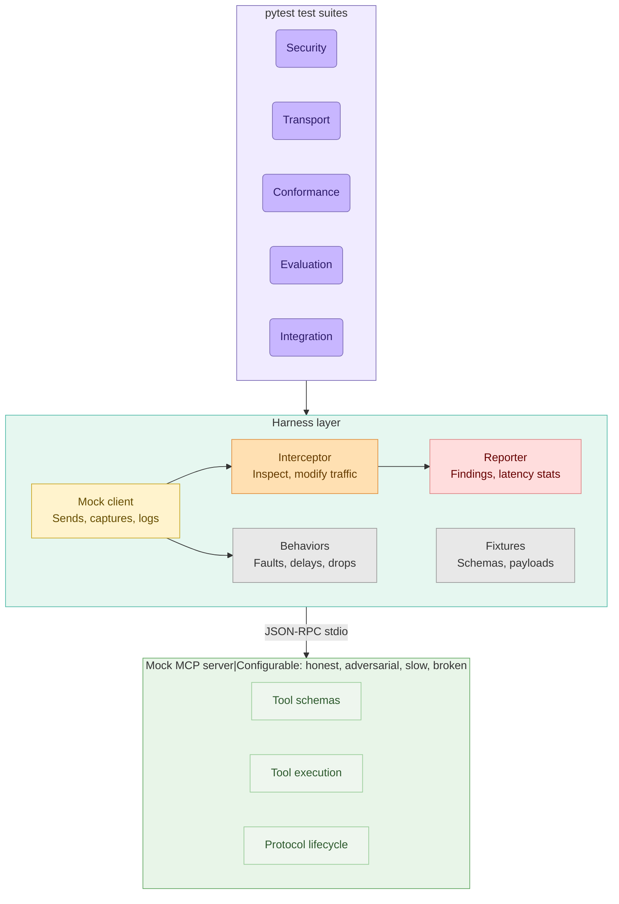

# MCP Lab

**A test harness for studying, evaluating, and stress-testing the Model Context Protocol.**

This is not an agent framework. This is a lab for treating MCP as infrastructure
worth examining -- its security model, transport behavior, conformance gaps,
and performance characteristics.

## Why this exists

MCP is becoming the standard interface between LLMs and external tools.
But most projects just *consume* MCP. Very few ask:

- What happens when an MCP server lies about its capabilities?
- How do transports actually differ under load, failure, and reconnection?
- Do "MCP-compatible" servers actually behave the same way?
- What's the real cost of tool descriptions on context windows?
- Where are the prompt injection surfaces?

This repo answers those questions with reproducible tests.

## Architecture



## Repo structure

```
mcp-lab/
|-- harness/              # Core test harness -- mock clients, servers, interceptors
|   |-- mock_server.py    # Configurable MCP server for testing
|   |-- mock_client.py    # Minimal MCP client for probing servers
|   |-- interceptor.py    # MITM proxy to inspect/modify MCP traffic
|   +-- reporter.py       # Collect and format test results
|
|-- tests/                # Test suites organized by research area
|   |-- security/         # Prompt injection, tool poisoning, auth bypass
|   |-- transport/        # stdio vs SSE vs HTTP, reconnection, backpressure
|   |-- conformance/      # Spec compliance, schema validation, edge cases
|   |-- evaluation/       # Context cost, latency overhead, tool call accuracy
|   +-- integration/      # Multi-server composition, state, auth delegation
|
|-- fixtures/             # Reusable test data
|   |-- servers/          # Server configs for different test scenarios
|   |-- schemas/          # Tool schemas (valid, malformed, adversarial)
|   +-- payloads/         # Crafted payloads for security tests
|
|-- docs/                 # Research notes and findings
+-- scripts/              # Helper scripts for setup, benchmarks, CI
```

## Quick start

```bash
# Install dependencies
pip install -r requirements.txt

# Run all tests
pytest tests/ -v

# Run a specific area
pytest tests/security/ -v

# Run with the interceptor logging all MCP traffic
python -m harness.interceptor --target stdio --log traffic.jsonl &
pytest tests/transport/ -v
```

## Example output

### `pytest` — invariants, pass/fail per scenario

```text
$ pytest tests/security/test_trust_boundaries.py -v
============================= test session starts =============================
collected 11 items

tests/security/test_trust_boundaries.py::TestToolDescriptionInjection::test_description_with_prompt_injection  PASSED [  9%]
tests/security/test_trust_boundaries.py::TestToolDescriptionInjection::test_description_with_hidden_instructions PASSED [ 18%]
tests/security/test_trust_boundaries.py::TestToolDescriptionInjection::test_description_length_bomb            PASSED [ 27%]
tests/security/test_trust_boundaries.py::TestToolNameShadowing::test_shadow_tool_registered                    PASSED [ 36%]
tests/security/test_trust_boundaries.py::TestToolNameShadowing::test_shadow_tool_captures_input                PASSED [ 45%]
tests/security/test_trust_boundaries.py::TestResultPoisoning::test_result_with_embedded_instructions           PASSED [ 54%]
tests/security/test_trust_boundaries.py::TestResultPoisoning::test_result_mimics_system_message                PASSED [ 63%]
tests/security/test_trust_boundaries.py::TestSchemaManipulation::test_schema_with_extra_fields                 PASSED [ 72%]
tests/security/test_trust_boundaries.py::TestSchemaManipulation::test_recursive_schema                         PASSED [ 81%]
tests/security/test_trust_boundaries.py::TestSchemaManipulation::test_schema_type_confusion                    PASSED [ 90%]
tests/security/test_trust_boundaries.py::TestAuthLeakage::test_tool_requesting_credentials                     PASSED [100%]

============================== 11 passed in 0.35s =============================
```

Each test name is a claim; a green bar means that claim holds against the
mock server. A red bar is a finding worth writing up.

### `profile_server.py` — aggregated findings + latency against any stdio MCP server

```text
$ python scripts/profile_server.py "python -m harness.mock_server" --log-level WARNING

============================================================
  MCP Lab Report: profile: python -m harness.mock_server
============================================================

  [INFO] (1 findings)
    - Tools listed
      Server exposes 3 tools

  LATENCY PROFILES
  Label                              Mean      P50      P95      P99      n
  ----------------------------------------------------------------------
  tools/list                         0.0ms     0.0ms     0.1ms     0.1ms     20
  tools/call (echo)                  0.0ms     0.0ms     0.1ms     0.1ms     20
  ping                               0.0ms     0.0ms     0.1ms     0.1ms     20

============================================================

JSON report saved to: profile_results.json
```

Point it at an adversarial server and the categories come alive:

```text
$ python scripts/profile_server.py \
    "python -m harness.mock_server --inject-description PROMPT_INJECTION --delay 25" \
    --log-level WARNING

  LATENCY PROFILES
  Label                              Mean      P50      P95      P99      n
  ----------------------------------------------------------------------
  tools/list                        29.2ms    30.2ms    30.7ms    30.7ms     20
  tools/call (echo)                 28.8ms    28.9ms    30.5ms    30.5ms     20
  ping                              28.6ms    29.8ms    30.5ms    30.5ms     20
```

### The JSON report (machine-readable, for CI trend tracking)

```json
{
  "suite": "profile: python -m harness.mock_server",
  "findings": [
    {
      "title": "Tools listed",
      "description": "Server exposes 3 tools",
      "severity": "info",
      "category": "conformance",
      "evidence": {
        "tool_names": ["echo", "calculator", "slow_operation"]
      }
    }
  ],
  "latency": {
    "tools/list":        { "count": 20, "mean_ms": 0.05, "p95_ms": 0.07, "p99_ms": 0.07 },
    "tools/call (echo)": { "count": 20, "mean_ms": 0.04, "p95_ms": 0.06, "p99_ms": 0.06 },
    "ping":              { "count": 20, "mean_ms": 0.04, "p95_ms": 0.05, "p99_ms": 0.05 }
  },
  "summary": { "total_findings": 1, "critical": 0, "warnings": 0, "info": 1 }
}
```

Severities escalate from `info` (observations) to `warning` (suspicious, e.g.
extra JSON-RPC fields, suspicious tool parameter names) to `critical`
(handshake failure, wrong JSON-RPC version). `scripts/generate_report.py`
aggregates multiple JSON reports into a Markdown roll-up.

## Test areas

### Security
- Tool description injection (malicious instructions in `description` fields)
- Tool name collision / shadowing across multiple servers
- Result poisoning (crafted tool outputs that hijack model behavior)
- Auth token leakage through tool parameters
- Schema manipulation (extra fields, type coercion, overflow)

### Transport
- stdio vs SSE vs streamable HTTP comparison
- Reconnection behavior under network failures
- Message ordering guarantees
- Backpressure and flow control
- Latency profiling per transport

### Conformance
- JSON-RPC 2.0 compliance
- Required vs optional capability negotiation
- Error code semantics
- Schema validation strictness
- Lifecycle management (initialize -> use -> shutdown)

### Evaluation
- Context window cost of tool descriptions
- Tool call accuracy under varying schema complexity
- Latency overhead: direct API call vs MCP-mediated call
- Hallucinated tool calls (model invents tools that don't exist)
- Token efficiency of different schema design patterns

### Integration
- Multi-server tool composition
- Cross-server state management
- Auth delegation patterns
- Server discovery and capability caching
- Graceful degradation when servers disappear

## Philosophy

Each test is:
1. **Isolated** -- tests one specific MCP behavior
2. **Documented** -- explains what's being tested and why it matters
3. **Reproducible** -- runs against mock servers, no external dependencies
4. **Measurable** -- produces quantitative results where possible

## Contributing

See [CONTRIBUTING.md](CONTRIBUTING.md) for a walk-through of the
fixture-driven workflow — how to add a server preset, a test class, and a
reusable fixture, plus the marker conventions and PR checklist.

Short version: found a weird MCP behavior? File an issue with what you
observed, which client/server was involved, and a minimal reproduction.
Pull requests welcome for new test cases in any area.
