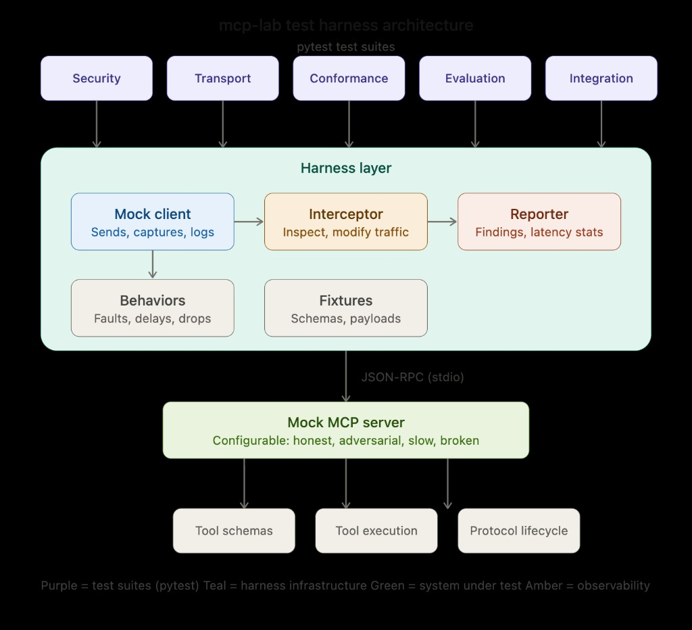

# MCP Lab

**A test harness for studying, evaluating, and stress-testing the Model Context Protocol.**

This is not an agent framework. This is a lab for treating MCP as infrastructure
worth examining -- its security model, transport behavior, conformance gaps,
and performance characteristics.

## Why this exists

MCP is becoming the standard interface between LLMs and external tools.
But most projects just *consume* MCP. Very few ask:

- What happens when an MCP server lies about its capabilities?
- How do transports actually differ under load, failure, and reconnection?
- Do "MCP-compatible" servers actually behave the same way?
- What's the real cost of tool descriptions on context windows?
- Where are the prompt injection surfaces?

This repo answers those questions with reproducible tests.

## Architecture



## Repo structure

```
mcp-lab/
|-- harness/              # Core test harness -- mock clients, servers, interceptors
|   |-- mock_server.py    # Configurable MCP server for testing
|   |-- mock_client.py    # Minimal MCP client for probing servers
|   |-- interceptor.py    # MITM proxy to inspect/modify MCP traffic
|   +-- reporter.py       # Collect and format test results
|
|-- tests/                # Test suites organized by research area
|   |-- security/         # Prompt injection, tool poisoning, auth bypass
|   |-- transport/        # stdio vs SSE vs HTTP, reconnection, backpressure
|   |-- conformance/      # Spec compliance, schema validation, edge cases
|   |-- evaluation/       # Context cost, latency overhead, tool call accuracy
|   +-- integration/      # Multi-server composition, state, auth delegation
|
|-- fixtures/             # Reusable test data
|   |-- servers/          # Server configs for different test scenarios
|   |-- schemas/          # Tool schemas (valid, malformed, adversarial)
|   +-- payloads/         # Crafted payloads for security tests
|
|-- docs/                 # Research notes and findings
+-- scripts/              # Helper scripts for setup, benchmarks, CI
```

## Quick start

```bash
# Install dependencies
pip install -r requirements.txt

# Run all tests
pytest tests/ -v

# Run a specific area
pytest tests/security/ -v

# Run with the interceptor logging all MCP traffic
python -m harness.interceptor --target stdio --log traffic.jsonl &
pytest tests/transport/ -v
```

## Test areas

### Security
- Tool description injection (malicious instructions in `description` fields)
- Tool name collision / shadowing across multiple servers
- Result poisoning (crafted tool outputs that hijack model behavior)
- Auth token leakage through tool parameters
- Schema manipulation (extra fields, type coercion, overflow)

### Transport
- stdio vs SSE vs streamable HTTP comparison
- Reconnection behavior under network failures
- Message ordering guarantees
- Backpressure and flow control
- Latency profiling per transport

### Conformance
- JSON-RPC 2.0 compliance
- Required vs optional capability negotiation
- Error code semantics
- Schema validation strictness
- Lifecycle management (initialize -> use -> shutdown)

### Evaluation
- Context window cost of tool descriptions
- Tool call accuracy under varying schema complexity
- Latency overhead: direct API call vs MCP-mediated call
- Hallucinated tool calls (model invents tools that don't exist)
- Token efficiency of different schema design patterns

### Integration
- Multi-server tool composition
- Cross-server state management
- Auth delegation patterns
- Server discovery and capability caching
- Graceful degradation when servers disappear

## Philosophy

Each test is:
1. **Isolated** -- tests one specific MCP behavior
2. **Documented** -- explains what's being tested and why it matters
3. **Reproducible** -- runs against mock servers, no external dependencies
4. **Measurable** -- produces quantitative results where possible

## Contributing

Found a weird MCP behavior? File an issue with:
- What you observed
- Which client/server was involved
- A minimal reproduction

Pull requests welcome for new test cases in any area.
